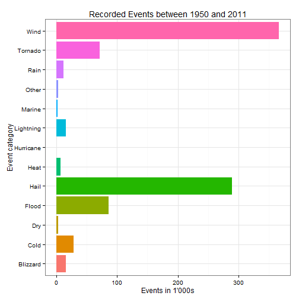
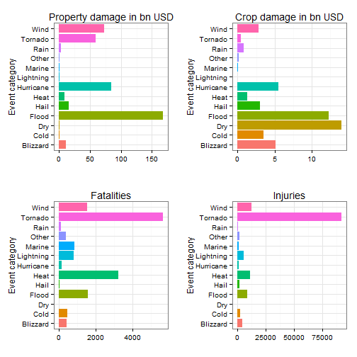

# Resources used for protecting against severe weather events in the US could have the biggest impact if used for tornado, wind and flood protection

## Synopsis
Storms and other severe weather events can be an economical threat by causing massive property damage, but also to public health by causing fatalities and injuries. Preventing such outcomes to the extent possible is a key concern, but as available resources are limited, their assginment to prevention measures needs to be prioritized.

Exploring the U.S. National Oceanic and Atmospheric Administration's (NOAA) storm database, this report shows which types of weather events were the most harmful in the time period between 1950 and 2013 both economically and for public health.

Therefore, the data is grouped into 12 categories of events, for which property damage, crop damage, fatalities and injuries during that time span are compared. An analysis of the data shows that tornadoes and comparable events have the most severe impact with respect to population health, whereas floods and wind in general have the strongest economic impact.
## Data processing
The input data is read directly from the bzipped data file as provided by NOAA.

```r
data <- read.csv(bzfile("repdata-data-StormData.csv.bz2"), header = TRUE)
```

For computational and memory reasons, only those columns that are required for the analysis are extracted:
* EVTYPE: Type of event
* BGN_DATE: Date when event began, dropped after YEAR is determined
* STATE: State where event took place
* FATALITIES: Number of fatalities caused by events
* INJURIES: Number of injuries caused by events
* PROPDMG and PROPDMGEXP: Property damage caused by events, dropped after propDam is calculated from these
* CROPDMG and CROPDMGEXP: Crop damage caused by events, dropped after cropDam is calculated from these
Additional Columns are created:
* YEAR: year of events, deducted from BGN_DATE
* DAMAGE: Damage caused by events, deducted from PROPDMG and PROPDMGEXP

```r
reducedData <- data[, c("EVTYPE", "BGN_DATE", "STATE", "FATALITIES", "INJURIES", 
    "PROPDMG", "PROPDMGEXP", "CROPDMG", "CROPDMGEXP")]
```

Both PROPDMGEXP and CROPDMGEXP are decoded into the following factors which are then multiplied by PROPDMG and CROPDMG:
* Letters are transformed to lowercase and interpreted as factors: b(illions = 10^9), m(illions = 10^6), k(ilos = 10^3) and h(undreds = 10^2)
* Numbers are used directly as factors, e.g. 5 = 10^5
* Other symbols are interpreted as factor 10^0 = 1


```r
reducedData$PROPDMGEXP <- tolower(reducedData$PROPDMGEXP)
table(reducedData$PROPDMGEXP)
```

```
## 
##             -      ?      +      0      1      2      3      4      5 
## 465934      1      8      5    216     25     13      4      4     28 
##      6      7      8      b      h      k      m 
##      4      5      1     40      7 424665  11337
```

```r
reducedData$propDam <- reducedData$PROPDMG * ifelse(reducedData$PROPDMGEXP == 
    "b", 10^9, ifelse(reducedData$PROPDMGEXP == "m", 10^6, ifelse(reducedData$PROPDMGEXP == 
    "k", 10^3, ifelse(reducedData$PROPDMGEXP == "h", 10^2, ifelse(is.numeric(reducedData$PROPDMGEXP), 
    10^reducedData$PROPDMGEXP, 1)))))

reducedData$CROPDMGEXP <- tolower(reducedData$CROPDMGEXP)
table(reducedData$CROPDMGEXP)
```

```
## 
##             ?      0      2      b      k      m 
## 618413      7     19      1      9 281853   1995
```

```r
reducedData$cropDam <- reducedData$CROPDMG * ifelse(reducedData$CROPDMGEXP == 
    "b", 10^9, ifelse(reducedData$CROPDMGEXP == "m", 10^6, ifelse(reducedData$CROPDMGEXP == 
    "k", 10^3, ifelse(reducedData$CROPDMGEXP == "h", 10^2, ifelse(is.numeric(reducedData$CROPDMGEXP), 
    10^reducedData$PROPDMGEXP, 1)))))
reducedData$PROPDMG <- NULL
reducedData$PROPDMGEXP <- NULL
reducedData$CROPDMG <- NULL
reducedData$CROPDMGEXP <- NULL
```

Fields for the year of event (not directly used in this analysis, however) and an event count are created:

```r
reducedData$year <- 1900 + strptime(reducedData$BGN_DATE, "%m/%d/%Y %H:%M:%S")$year
reducedData$BGN_DATE <- NULL
reducedData$count <- 1
```

After transforming all event types to lowercase, there are roughly 900 distinct types of events listed

```r
reducedData$EVTYPE <- as.factor(tolower(reducedData$EVTYPE))
levels(droplevels(reducedData$EVTYPE))
```

```
##   [1] "   high surf advisory"          " coastal flood"                
##   [3] " flash flood"                   " lightning"                    
##   [5] " tstm wind"                     " tstm wind (g45)"              
##   [7] " waterspout"                    " wind"                         
##   [9] "?"                              "abnormal warmth"               
##  [11] "abnormally dry"                 "abnormally wet"                
##  [13] "accumulated snowfall"           "agricultural freeze"           
##  [15] "apache county"                  "astronomical high tide"        
##  [17] "astronomical low tide"          "avalance"                      
##  [19] "avalanche"                      "beach erosin"                  
##  [21] "beach erosion"                  "beach erosion/coastal flood"   
##  [23] "beach flood"                    "below normal precipitation"    
##  [25] "bitter wind chill"              "bitter wind chill temperatures"
##  [27] "black ice"                      "blizzard"                      
##  [29] "blizzard and extreme wind chil" "blizzard and heavy snow"       
##  [31] "blizzard summary"               "blizzard weather"              
##  [33] "blizzard/freezing rain"         "blizzard/heavy snow"           
##  [35] "blizzard/high wind"             "blizzard/winter storm"         
##  [37] "blow-out tide"                  "blow-out tides"                
##  [39] "blowing dust"                   "blowing snow"                  
##  [41] "blowing snow- extreme wind chi" "blowing snow & extreme wind ch"
##  [43] "blowing snow/extreme wind chil" "breakup flooding"              
##  [45] "brush fire"                     "brush fires"                   
##  [47] "coastal  flooding/erosion"      "coastal erosion"               
##  [49] "coastal flood"                  "coastal flooding"              
##  [51] "coastal flooding/erosion"       "coastal storm"                 
##  [53] "coastal surge"                  "coastal/tidal flood"           
##  [55] "coastalflood"                   "coastalstorm"                  
##  [57] "cold"                           "cold air funnel"               
##  [59] "cold air funnels"               "cold air tornado"              
##  [61] "cold and frost"                 "cold and snow"                 
##  [63] "cold and wet conditions"        "cold temperature"              
##  [65] "cold temperatures"              "cold wave"                     
##  [67] "cold weather"                   "cold wind chill temperatures"  
##  [69] "cold/wind chill"                "cold/winds"                    
##  [71] "cool and wet"                   "cool spell"                    
##  [73] "cstl flooding/erosion"          "dam break"                     
##  [75] "dam failure"                    "damaging freeze"               
##  [77] "deep hail"                      "dense fog"                     
##  [79] "dense smoke"                    "downburst"                     
##  [81] "downburst winds"                "driest month"                  
##  [83] "drifting snow"                  "drought"                       
##  [85] "drought/excessive heat"         "drowning"                      
##  [87] "dry"                            "dry conditions"                
##  [89] "dry hot weather"                "dry microburst"                
##  [91] "dry microburst 50"              "dry microburst 53"             
##  [93] "dry microburst 58"              "dry microburst 61"             
##  [95] "dry microburst 84"              "dry microburst winds"          
##  [97] "dry mircoburst winds"           "dry pattern"                   
##  [99] "dry spell"                      "dry weather"                   
## [101] "dryness"                        "dust devel"                    
## [103] "dust devil"                     "dust devil waterspout"         
## [105] "dust storm"                     "dust storm/high winds"         
## [107] "duststorm"                      "early freeze"                  
## [109] "early frost"                    "early rain"                    
## [111] "early snow"                     "early snowfall"                
## [113] "erosion/cstl flood"             "excessive"                     
## [115] "excessive cold"                 "excessive heat"                
## [117] "excessive heat/drought"         "excessive precipitation"       
## [119] "excessive rain"                 "excessive rainfall"            
## [121] "excessive snow"                 "excessive wetness"             
## [123] "excessively dry"                "extended cold"                 
## [125] "extreme cold"                   "extreme cold/wind chill"       
## [127] "extreme heat"                   "extreme wind chill"            
## [129] "extreme wind chill/blowing sno" "extreme wind chills"           
## [131] "extreme windchill"              "extreme windchill temperatures"
## [133] "extreme/record cold"            "extremely wet"                 
## [135] "falling snow/ice"               "first frost"                   
## [137] "first snow"                     "flash flood"                   
## [139] "flash flood - heavy rain"       "flash flood from ice jams"     
## [141] "flash flood landslides"         "flash flood winds"             
## [143] "flash flood/"                   "flash flood/ flood"            
## [145] "flash flood/ street"            "flash flood/flood"             
## [147] "flash flood/heavy rain"         "flash flood/landslide"         
## [149] "flash flooding"                 "flash flooding/flood"          
## [151] "flash flooding/thunderstorm wi" "flash floods"                  
## [153] "flash floooding"                "flood"                         
## [155] "flood & heavy rain"             "flood flash"                   
## [157] "flood flood/flash"              "flood watch/"                  
## [159] "flood/flash"                    "flood/flash flood"             
## [161] "flood/flash flooding"           "flood/flash/flood"             
## [163] "flood/flashflood"               "flood/rain/wind"               
## [165] "flood/rain/winds"               "flood/river flood"             
## [167] "flood/strong wind"              "flooding"                      
## [169] "flooding/heavy rain"            "floods"                        
## [171] "fog"                            "fog and cold temperatures"     
## [173] "forest fires"                   "freeze"                        
## [175] "freezing drizzle"               "freezing drizzle and freezing" 
## [177] "freezing fog"                   "freezing rain"                 
## [179] "freezing rain and sleet"        "freezing rain and snow"        
## [181] "freezing rain sleet and"        "freezing rain sleet and light" 
## [183] "freezing rain/sleet"            "freezing rain/snow"            
## [185] "freezing spray"                 "frost"                         
## [187] "frost/freeze"                   "frost\\freeze"                 
## [189] "funnel"                         "funnel cloud"                  
## [191] "funnel cloud."                  "funnel cloud/hail"             
## [193] "funnel clouds"                  "funnels"                       
## [195] "glaze"                          "glaze ice"                     
## [197] "glaze/ice storm"                "gradient wind"                 
## [199] "gradient winds"                 "grass fires"                   
## [201] "ground blizzard"                "gustnado"                      
## [203] "gustnado and"                   "gusty lake wind"               
## [205] "gusty thunderstorm wind"        "gusty thunderstorm winds"      
## [207] "gusty wind"                     "gusty wind/hail"               
## [209] "gusty wind/hvy rain"            "gusty wind/rain"               
## [211] "gusty winds"                    "hail"                          
## [213] "hail 0.75"                      "hail 0.88"                     
## [215] "hail 075"                       "hail 088"                      
## [217] "hail 1.00"                      "hail 1.75"                     
## [219] "hail 1.75)"                     "hail 100"                      
## [221] "hail 125"                       "hail 150"                      
## [223] "hail 175"                       "hail 200"                      
## [225] "hail 225"                       "hail 275"                      
## [227] "hail 450"                       "hail 75"                       
## [229] "hail 80"                        "hail 88"                       
## [231] "hail aloft"                     "hail damage"                   
## [233] "hail flooding"                  "hail storm"                    
## [235] "hail(0.75)"                     "hail/icy roads"                
## [237] "hail/wind"                      "hail/winds"                    
## [239] "hailstorm"                      "hailstorms"                    
## [241] "hard freeze"                    "hazardous surf"                
## [243] "heat"                           "heat drought"                  
## [245] "heat wave"                      "heat wave drought"             
## [247] "heat waves"                     "heat/drought"                  
## [249] "heatburst"                      "heavy lake snow"               
## [251] "heavy mix"                      "heavy precipatation"           
## [253] "heavy precipitation"            "heavy rain"                    
## [255] "heavy rain and flood"           "heavy rain and wind"           
## [257] "heavy rain effects"             "heavy rain/flooding"           
## [259] "heavy rain/high surf"           "heavy rain/lightning"          
## [261] "heavy rain/mudslides/flood"     "heavy rain/severe weather"     
## [263] "heavy rain/small stream urban"  "heavy rain/snow"               
## [265] "heavy rain/urban flood"         "heavy rain/wind"               
## [267] "heavy rain; urban flood winds;" "heavy rainfall"                
## [269] "heavy rains"                    "heavy rains/flooding"          
## [271] "heavy seas"                     "heavy shower"                  
## [273] "heavy showers"                  "heavy snow"                    
## [275] "heavy snow-squalls"             "heavy snow   freezing rain"    
## [277] "heavy snow & ice"               "heavy snow and"                
## [279] "heavy snow and high winds"      "heavy snow and ice"            
## [281] "heavy snow and ice storm"       "heavy snow and strong winds"   
## [283] "heavy snow andblowing snow"     "heavy snow shower"             
## [285] "heavy snow squalls"             "heavy snow/blizzard"           
## [287] "heavy snow/blizzard/avalanche"  "heavy snow/blowing snow"       
## [289] "heavy snow/freezing rain"       "heavy snow/high"               
## [291] "heavy snow/high wind"           "heavy snow/high winds"         
## [293] "heavy snow/high winds & flood"  "heavy snow/high winds/freezing"
## [295] "heavy snow/ice"                 "heavy snow/ice storm"          
## [297] "heavy snow/sleet"               "heavy snow/squalls"            
## [299] "heavy snow/wind"                "heavy snow/winter storm"       
## [301] "heavy snowpack"                 "heavy surf"                    
## [303] "heavy surf and wind"            "heavy surf coastal flooding"   
## [305] "heavy surf/high surf"           "heavy swells"                  
## [307] "heavy wet snow"                 "high"                          
## [309] "high  swells"                   "high  winds"                   
## [311] "high seas"                      "high surf"                     
## [313] "high surf advisories"           "high surf advisory"            
## [315] "high swells"                    "high temperature record"       
## [317] "high tides"                     "high water"                    
## [319] "high waves"                     "high wind"                     
## [321] "high wind (g40)"                "high wind 48"                  
## [323] "high wind 63"                   "high wind 70"                  
## [325] "high wind and heavy snow"       "high wind and high tides"      
## [327] "high wind and seas"             "high wind damage"              
## [329] "high wind/ blizzard"            "high wind/blizzard"            
## [331] "high wind/blizzard/freezing ra" "high wind/heavy snow"          
## [333] "high wind/low wind chill"       "high wind/seas"                
## [335] "high wind/wind chill"           "high wind/wind chill/blizzard" 
## [337] "high winds"                     "high winds 55"                 
## [339] "high winds 57"                  "high winds 58"                 
## [341] "high winds 63"                  "high winds 66"                 
## [343] "high winds 67"                  "high winds 73"                 
## [345] "high winds 76"                  "high winds 80"                 
## [347] "high winds 82"                  "high winds and wind chill"     
## [349] "high winds dust storm"          "high winds heavy rains"        
## [351] "high winds/"                    "high winds/coastal flood"      
## [353] "high winds/cold"                "high winds/flooding"           
## [355] "high winds/heavy rain"          "high winds/snow"               
## [357] "highway flooding"               "hot and dry"                   
## [359] "hot pattern"                    "hot spell"                     
## [361] "hot weather"                    "hot/dry pattern"               
## [363] "hurricane"                      "hurricane-generated swells"    
## [365] "hurricane edouard"              "hurricane emily"               
## [367] "hurricane erin"                 "hurricane felix"               
## [369] "hurricane gordon"               "hurricane opal"                
## [371] "hurricane opal/high winds"      "hurricane/typhoon"             
## [373] "hvy rain"                       "hyperthermia/exposure"         
## [375] "hypothermia"                    "hypothermia/exposure"          
## [377] "ice"                            "ice and snow"                  
## [379] "ice floes"                      "ice fog"                       
## [381] "ice jam"                        "ice jam flood (minor"          
## [383] "ice jam flooding"               "ice on road"                   
## [385] "ice pellets"                    "ice roads"                     
## [387] "ice storm"                      "ice storm and snow"            
## [389] "ice storm/flash flood"          "ice/snow"                      
## [391] "ice/strong winds"               "icestorm/blizzard"             
## [393] "icy roads"                      "lack of snow"                  
## [395] "lake-effect snow"               "lake effect snow"              
## [397] "lake flood"                     "lakeshore flood"               
## [399] "landslide"                      "landslide/urban flood"         
## [401] "landslides"                     "landslump"                     
## [403] "landspout"                      "large wall cloud"              
## [405] "late-season snowfall"           "late freeze"                   
## [407] "late season hail"               "late season snow"              
## [409] "late season snowfall"           "late snow"                     
## [411] "light freezing rain"            "light snow"                    
## [413] "light snow and sleet"           "light snow/flurries"           
## [415] "light snow/freezing precip"     "light snowfall"                
## [417] "lighting"                       "lightning"                     
## [419] "lightning  wauseon"             "lightning and heavy rain"      
## [421] "lightning and thunderstorm win" "lightning and winds"           
## [423] "lightning damage"               "lightning fire"                
## [425] "lightning injury"               "lightning thunderstorm winds"  
## [427] "lightning thunderstorm windss"  "lightning."                    
## [429] "lightning/heavy rain"           "ligntning"                     
## [431] "local flash flood"              "local flood"                   
## [433] "locally heavy rain"             "low temperature"               
## [435] "low temperature record"         "low wind chill"                
## [437] "major flood"                    "marine accident"               
## [439] "marine hail"                    "marine high wind"              
## [441] "marine mishap"                  "marine strong wind"            
## [443] "marine thunderstorm wind"       "marine tstm wind"              
## [445] "metro storm, may 26"            "microburst"                    
## [447] "microburst winds"               "mild and dry pattern"          
## [449] "mild pattern"                   "mild/dry pattern"              
## [451] "minor flood"                    "minor flooding"                
## [453] "mixed precip"                   "mixed precipitation"           
## [455] "moderate snow"                  "moderate snowfall"             
## [457] "monthly precipitation"          "monthly rainfall"              
## [459] "monthly snowfall"               "monthly temperature"           
## [461] "mountain snows"                 "mud slide"                     
## [463] "mud slides"                     "mud slides urban flooding"     
## [465] "mud/rock slide"                 "mudslide"                      
## [467] "mudslide/landslide"             "mudslides"                     
## [469] "near record snow"               "no severe weather"             
## [471] "non-severe wind damage"         "non-tstm wind"                 
## [473] "non severe hail"                "non tstm wind"                 
## [475] "none"                           "normal precipitation"          
## [477] "northern lights"                "other"                         
## [479] "patchy dense fog"               "patchy ice"                    
## [481] "prolong cold"                   "prolong cold/snow"             
## [483] "prolong warmth"                 "prolonged rain"                
## [485] "rain"                           "rain (heavy)"                  
## [487] "rain and wind"                  "rain damage"                   
## [489] "rain/snow"                      "rain/wind"                     
## [491] "rainstorm"                      "rapidly rising water"          
## [493] "record  cold"                   "record cold"                   
## [495] "record cold and high wind"      "record cold/frost"             
## [497] "record cool"                    "record dry month"              
## [499] "record dryness"                 "record heat"                   
## [501] "record heat wave"               "record high"                   
## [503] "record high temperature"        "record high temperatures"      
## [505] "record low"                     "record low rainfall"           
## [507] "record may snow"                "record precipitation"          
## [509] "record rainfall"                "record snow"                   
## [511] "record snow/cold"               "record snowfall"               
## [513] "record temperature"             "record temperatures"           
## [515] "record warm"                    "record warm temps."            
## [517] "record warmth"                  "record winter snow"            
## [519] "record/excessive heat"          "record/excessive rainfall"     
## [521] "red flag criteria"              "red flag fire wx"              
## [523] "remnants of floyd"              "rip current"                   
## [525] "rip currents"                   "rip currents heavy surf"       
## [527] "rip currents/heavy surf"        "river and stream flood"        
## [529] "river flood"                    "river flooding"                
## [531] "rock slide"                     "rogue wave"                    
## [533] "rotating wall cloud"            "rough seas"                    
## [535] "rough surf"                     "rural flood"                   
## [537] "saharan dust"                   "seasonal snowfall"             
## [539] "seiche"                         "severe cold"                   
## [541] "severe thunderstorm"            "severe thunderstorm winds"     
## [543] "severe thunderstorms"           "severe turbulence"             
## [545] "sleet"                          "sleet & freezing rain"         
## [547] "sleet storm"                    "sleet/freezing rain"           
## [549] "sleet/ice storm"                "sleet/rain/snow"               
## [551] "sleet/snow"                     "small hail"                    
## [553] "small stream"                   "small stream and"              
## [555] "small stream and urban flood"   "small stream and urban floodin"
## [557] "small stream flood"             "small stream flooding"         
## [559] "small stream urban flood"       "small stream/urban flood"      
## [561] "sml stream fld"                 "smoke"                         
## [563] "snow"                           "snow- high wind- wind chill"   
## [565] "snow accumulation"              "snow advisory"                 
## [567] "snow and cold"                  "snow and heavy snow"           
## [569] "snow and ice"                   "snow and ice storm"            
## [571] "snow and sleet"                 "snow and wind"                 
## [573] "snow drought"                   "snow freezing rain"            
## [575] "snow showers"                   "snow sleet"                    
## [577] "snow squall"                    "snow squalls"                  
## [579] "snow/ bitter cold"              "snow/ ice"                     
## [581] "snow/blowing snow"              "snow/cold"                     
## [583] "snow/freezing rain"             "snow/heavy snow"               
## [585] "snow/high winds"                "snow/ice"                      
## [587] "snow/ice storm"                 "snow/rain"                     
## [589] "snow/rain/sleet"                "snow/sleet"                    
## [591] "snow/sleet/freezing rain"       "snow/sleet/rain"               
## [593] "snow\\cold"                     "snowfall record"               
## [595] "snowmelt flooding"              "snowstorm"                     
## [597] "southeast"                      "storm force winds"             
## [599] "storm surge"                    "storm surge/tide"              
## [601] "stream flooding"                "street flood"                  
## [603] "street flooding"                "strong wind"                   
## [605] "strong wind gust"               "strong winds"                  
## [607] "summary august 10"              "summary august 11"             
## [609] "summary august 17"              "summary august 2-3"            
## [611] "summary august 21"              "summary august 28"             
## [613] "summary august 4"               "summary august 7"              
## [615] "summary august 9"               "summary jan 17"                
## [617] "summary july 23-24"             "summary june 18-19"            
## [619] "summary june 5-6"               "summary june 6"                
## [621] "summary of april 12"            "summary of april 13"           
## [623] "summary of april 21"            "summary of april 27"           
## [625] "summary of april 3rd"           "summary of august 1"           
## [627] "summary of july 11"             "summary of july 2"             
## [629] "summary of july 22"             "summary of july 26"            
## [631] "summary of july 29"             "summary of july 3"             
## [633] "summary of june 10"             "summary of june 11"            
## [635] "summary of june 12"             "summary of june 13"            
## [637] "summary of june 15"             "summary of june 16"            
## [639] "summary of june 18"             "summary of june 23"            
## [641] "summary of june 24"             "summary of june 3"             
## [643] "summary of june 30"             "summary of june 4"             
## [645] "summary of june 6"              "summary of march 14"           
## [647] "summary of march 23"            "summary of march 24"           
## [649] "summary of march 24-25"         "summary of march 27"           
## [651] "summary of march 29"            "summary of may 10"             
## [653] "summary of may 13"              "summary of may 14"             
## [655] "summary of may 22"              "summary of may 22 am"          
## [657] "summary of may 22 pm"           "summary of may 26 am"          
## [659] "summary of may 26 pm"           "summary of may 31 am"          
## [661] "summary of may 31 pm"           "summary of may 9-10"           
## [663] "summary sept. 25-26"            "summary september 20"          
## [665] "summary september 23"           "summary september 3"           
## [667] "summary september 4"            "summary: nov. 16"              
## [669] "summary: nov. 6-7"              "summary: oct. 20-21"           
## [671] "summary: october 31"            "summary: sept. 18"             
## [673] "temperature record"             "thuderstorm winds"             
## [675] "thundeerstorm winds"            "thunderestorm winds"           
## [677] "thundersnow"                    "thundersnow shower"            
## [679] "thunderstorm"                   "thunderstorm  winds"           
## [681] "thunderstorm damage"            "thunderstorm damage to"        
## [683] "thunderstorm hail"              "thunderstorm w inds"           
## [685] "thunderstorm wind"              "thunderstorm wind (g40)"       
## [687] "thunderstorm wind 50"           "thunderstorm wind 52"          
## [689] "thunderstorm wind 56"           "thunderstorm wind 59"          
## [691] "thunderstorm wind 59 mph"       "thunderstorm wind 59 mph."     
## [693] "thunderstorm wind 60 mph"       "thunderstorm wind 65 mph"      
## [695] "thunderstorm wind 65mph"        "thunderstorm wind 69"          
## [697] "thunderstorm wind 98 mph"       "thunderstorm wind g50"         
## [699] "thunderstorm wind g51"          "thunderstorm wind g52"         
## [701] "thunderstorm wind g55"          "thunderstorm wind g60"         
## [703] "thunderstorm wind g61"          "thunderstorm wind trees"       
## [705] "thunderstorm wind."             "thunderstorm wind/ tree"       
## [707] "thunderstorm wind/ trees"       "thunderstorm wind/awning"      
## [709] "thunderstorm wind/hail"         "thunderstorm wind/lightning"   
## [711] "thunderstorm winds"             "thunderstorm winds      le cen"
## [713] "thunderstorm winds 13"          "thunderstorm winds 2"          
## [715] "thunderstorm winds 50"          "thunderstorm winds 52"         
## [717] "thunderstorm winds 53"          "thunderstorm winds 60"         
## [719] "thunderstorm winds 61"          "thunderstorm winds 62"         
## [721] "thunderstorm winds 63 mph"      "thunderstorm winds and"        
## [723] "thunderstorm winds funnel clou" "thunderstorm winds g"          
## [725] "thunderstorm winds g60"         "thunderstorm winds hail"       
## [727] "thunderstorm winds heavy rain"  "thunderstorm winds lightning"  
## [729] "thunderstorm winds small strea" "thunderstorm winds urban flood"
## [731] "thunderstorm winds."            "thunderstorm winds/ flood"     
## [733] "thunderstorm winds/ hail"       "thunderstorm winds/flash flood"
## [735] "thunderstorm winds/flooding"    "thunderstorm winds/funnel clou"
## [737] "thunderstorm winds/hail"        "thunderstorm winds/heavy rain" 
## [739] "thunderstorm winds53"           "thunderstorm windshail"        
## [741] "thunderstorm windss"            "thunderstorm wins"             
## [743] "thunderstorms"                  "thunderstorms wind"            
## [745] "thunderstorms winds"            "thunderstormw"                 
## [747] "thunderstormw 50"               "thunderstormw winds"           
## [749] "thunderstormwinds"              "thunderstrom wind"             
## [751] "thunderstrom winds"             "thundertorm winds"             
## [753] "thundertsorm wind"              "thundestorm winds"             
## [755] "thunerstorm winds"              "tidal flood"                   
## [757] "tidal flooding"                 "tornado"                       
## [759] "tornado debris"                 "tornado f0"                    
## [761] "tornado f1"                     "tornado f2"                    
## [763] "tornado f3"                     "tornado/waterspout"            
## [765] "tornadoes"                      "tornadoes, tstm wind, hail"    
## [767] "tornados"                       "torndao"                       
## [769] "torrential rain"                "torrential rainfall"           
## [771] "tropical depression"            "tropical storm"                
## [773] "tropical storm alberto"         "tropical storm dean"           
## [775] "tropical storm gordon"          "tropical storm jerry"          
## [777] "tstm"                           "tstm heavy rain"               
## [779] "tstm wind"                      "tstm wind  (g45)"              
## [781] "tstm wind (41)"                 "tstm wind (g35)"               
## [783] "tstm wind (g40)"                "tstm wind (g45)"               
## [785] "tstm wind 40"                   "tstm wind 45"                  
## [787] "tstm wind 50"                   "tstm wind 51"                  
## [789] "tstm wind 52"                   "tstm wind 55"                  
## [791] "tstm wind 65)"                  "tstm wind and lightning"       
## [793] "tstm wind damage"               "tstm wind g45"                 
## [795] "tstm wind g58"                  "tstm wind/hail"                
## [797] "tstm winds"                     "tstm wnd"                      
## [799] "tstmw"                          "tsunami"                       
## [801] "tunderstorm wind"               "typhoon"                       
## [803] "unseasonable cold"              "unseasonably cold"             
## [805] "unseasonably cool"              "unseasonably cool & wet"       
## [807] "unseasonably dry"               "unseasonably hot"              
## [809] "unseasonably warm"              "unseasonably warm & wet"       
## [811] "unseasonably warm and dry"      "unseasonably warm year"        
## [813] "unseasonably warm/wet"          "unseasonably wet"              
## [815] "unseasonal low temp"            "unseasonal rain"               
## [817] "unusual warmth"                 "unusual/record warmth"         
## [819] "unusually cold"                 "unusually late snow"           
## [821] "unusually warm"                 "urban and small"               
## [823] "urban and small stream"         "urban and small stream flood"  
## [825] "urban and small stream floodin" "urban flood"                   
## [827] "urban flood landslide"          "urban flooding"                
## [829] "urban floods"                   "urban small"                   
## [831] "urban small stream flood"       "urban/small"                   
## [833] "urban/small flooding"           "urban/small stream"            
## [835] "urban/small stream  flood"      "urban/small stream flood"      
## [837] "urban/small stream flooding"    "urban/small strm fldg"         
## [839] "urban/sml stream fld"           "urban/sml stream fldg"         
## [841] "urban/street flooding"          "very dry"                      
## [843] "very warm"                      "vog"                           
## [845] "volcanic ash"                   "volcanic ash plume"            
## [847] "volcanic ashfall"               "volcanic eruption"             
## [849] "wake low wind"                  "wall cloud"                    
## [851] "wall cloud/funnel cloud"        "warm dry conditions"           
## [853] "warm weather"                   "water spout"                   
## [855] "waterspout"                     "waterspout-"                   
## [857] "waterspout-tornado"             "waterspout funnel cloud"       
## [859] "waterspout tornado"             "waterspout/"                   
## [861] "waterspout/ tornado"            "waterspout/tornado"            
## [863] "waterspouts"                    "wayterspout"                   
## [865] "wet micoburst"                  "wet microburst"                
## [867] "wet month"                      "wet snow"                      
## [869] "wet weather"                    "wet year"                      
## [871] "whirlwind"                      "wild fires"                    
## [873] "wild/forest fire"               "wild/forest fires"             
## [875] "wildfire"                       "wildfires"                     
## [877] "wind"                           "wind advisory"                 
## [879] "wind and wave"                  "wind chill"                    
## [881] "wind chill/high wind"           "wind damage"                   
## [883] "wind gusts"                     "wind storm"                    
## [885] "wind/hail"                      "winds"                         
## [887] "winter mix"                     "winter storm"                  
## [889] "winter storm high winds"        "winter storm/high wind"        
## [891] "winter storm/high winds"        "winter storms"                 
## [893] "winter weather"                 "winter weather mix"            
## [895] "winter weather/mix"             "wintery mix"                   
## [897] "wintry mix"                     "wnd"
```

Out of these, all events described as summaries are removed

```r
reducedData <- reducedData[!grepl("summa", reducedData$EVTYPE, ignore.case = TRUE), 
    ]
```

The remaining events are assigned to broader categories

* Tornadoes, also containing gustnados, funnel clouds, water spouts and dust devils
* Blizzards, also containing winter storms and ice storms
* Cold related events such as snow, ice, general winter events, frost, etc.
* Hail
* Rain
* Wind, including storms and hurricanes
* Floods
* Marine, containing rip currents, tides and tsunamis
* Lightning
* Heat related events, including Fires
* Dryness
* Other events  

This categorization is constructed as disjunct, i.e. any event is assigned to exactly one of these categories in the above order. The assignment is performed by searching key strings in the EVTYPE variable. After this grouping, only a small proportion of the original data could not be assigned to any of the categories, which means that it was by definition assigned to category Other. The following tables show which event was assigned to which category.

```r
reducedData$evCat <- NA
reducedData$evCat[grepl("torna|gustna|funnel|spout|dust dev", reducedData$EVTYPE, 
    ignore.case = TRUE) & is.na(reducedData$evCat)] <- "Tornado"
levels(droplevels(reducedData$EVTYPE[reducedData$evCat == "Tornado"]))
```

```
##  [1] " waterspout"                    "cold air funnel"               
##  [3] "cold air funnels"               "cold air tornado"              
##  [5] "dust devel"                     "dust devil"                    
##  [7] "dust devil waterspout"          "funnel"                        
##  [9] "funnel cloud"                   "funnel cloud."                 
## [11] "funnel cloud/hail"              "funnel clouds"                 
## [13] "funnels"                        "gustnado"                      
## [15] "gustnado and"                   "landspout"                     
## [17] "thunderstorm winds funnel clou" "thunderstorm winds/funnel clou"
## [19] "tornado"                        "tornado debris"                
## [21] "tornado f0"                     "tornado f1"                    
## [23] "tornado f2"                     "tornado f3"                    
## [25] "tornado/waterspout"             "tornadoes"                     
## [27] "tornadoes, tstm wind, hail"     "tornados"                      
## [29] "wall cloud/funnel cloud"        "water spout"                   
## [31] "waterspout"                     "waterspout-"                   
## [33] "waterspout-tornado"             "waterspout funnel cloud"       
## [35] "waterspout tornado"             "waterspout/"                   
## [37] "waterspout/ tornado"            "waterspout/tornado"            
## [39] "waterspouts"                    "wayterspout"
```

```r
reducedData$evCat[grepl("blitz|bliz|winter sto|ice sto", reducedData$EVTYPE, 
    ignore.case = TRUE) & is.na(reducedData$evCat)] <- "Blizzard"
levels(droplevels(reducedData$EVTYPE[reducedData$evCat == "Blizzard"]))
```

```
##  [1] "blizzard"                       "blizzard and extreme wind chil"
##  [3] "blizzard and heavy snow"        "blizzard weather"              
##  [5] "blizzard/freezing rain"         "blizzard/heavy snow"           
##  [7] "blizzard/high wind"             "blizzard/winter storm"         
##  [9] "glaze/ice storm"                "ground blizzard"               
## [11] "heavy snow and ice storm"       "heavy snow/blizzard"           
## [13] "heavy snow/blizzard/avalanche"  "heavy snow/ice storm"          
## [15] "heavy snow/winter storm"        "high wind/ blizzard"           
## [17] "high wind/blizzard"             "high wind/blizzard/freezing ra"
## [19] "high wind/wind chill/blizzard"  "ice storm"                     
## [21] "ice storm and snow"             "ice storm/flash flood"         
## [23] "icestorm/blizzard"              "sleet/ice storm"               
## [25] "snow and ice storm"             "snow/ice storm"                
## [27] "winter storm"                   "winter storm high winds"       
## [29] "winter storm/high wind"         "winter storm/high winds"       
## [31] "winter storms"
```

```r
reducedData$evCat[grepl("snow|ice|icy|freez|wint|cold|frost|chill|hypotherm", 
    reducedData$EVTYPE, ignore.case = TRUE) & is.na(reducedData$evCat)] <- "Cold"
levels(droplevels(reducedData$EVTYPE[reducedData$evCat == "Cold"]))
```

```
##   [1] "accumulated snowfall"           "agricultural freeze"           
##   [3] "bitter wind chill"              "bitter wind chill temperatures"
##   [5] "black ice"                      "blowing snow"                  
##   [7] "blowing snow- extreme wind chi" "blowing snow & extreme wind ch"
##   [9] "blowing snow/extreme wind chil" "cold"                          
##  [11] "cold and frost"                 "cold and snow"                 
##  [13] "cold and wet conditions"        "cold temperature"              
##  [15] "cold temperatures"              "cold wave"                     
##  [17] "cold weather"                   "cold wind chill temperatures"  
##  [19] "cold/wind chill"                "cold/winds"                    
##  [21] "damaging freeze"                "drifting snow"                 
##  [23] "early freeze"                   "early frost"                   
##  [25] "early snow"                     "early snowfall"                
##  [27] "excessive cold"                 "excessive snow"                
##  [29] "extended cold"                  "extreme cold"                  
##  [31] "extreme cold/wind chill"        "extreme wind chill"            
##  [33] "extreme wind chill/blowing sno" "extreme wind chills"           
##  [35] "extreme windchill"              "extreme windchill temperatures"
##  [37] "extreme/record cold"            "falling snow/ice"              
##  [39] "first frost"                    "first snow"                    
##  [41] "flash flood from ice jams"      "fog and cold temperatures"     
##  [43] "freeze"                         "freezing drizzle"              
##  [45] "freezing drizzle and freezing"  "freezing fog"                  
##  [47] "freezing rain"                  "freezing rain and sleet"       
##  [49] "freezing rain and snow"         "freezing rain sleet and"       
##  [51] "freezing rain sleet and light"  "freezing rain/sleet"           
##  [53] "freezing rain/snow"             "freezing spray"                
##  [55] "frost"                          "frost/freeze"                  
##  [57] "frost\\freeze"                  "glaze ice"                     
##  [59] "hail/icy roads"                 "hard freeze"                   
##  [61] "heavy lake snow"                "heavy rain/snow"               
##  [63] "heavy snow"                     "heavy snow-squalls"            
##  [65] "heavy snow   freezing rain"     "heavy snow & ice"              
##  [67] "heavy snow and"                 "heavy snow and high winds"     
##  [69] "heavy snow and ice"             "heavy snow and strong winds"   
##  [71] "heavy snow andblowing snow"     "heavy snow shower"             
##  [73] "heavy snow squalls"             "heavy snow/blowing snow"       
##  [75] "heavy snow/freezing rain"       "heavy snow/high"               
##  [77] "heavy snow/high wind"           "heavy snow/high winds"         
##  [79] "heavy snow/high winds & flood"  "heavy snow/high winds/freezing"
##  [81] "heavy snow/ice"                 "heavy snow/sleet"              
##  [83] "heavy snow/squalls"             "heavy snow/wind"               
##  [85] "heavy snowpack"                 "heavy wet snow"                
##  [87] "high wind and heavy snow"       "high wind/heavy snow"          
##  [89] "high wind/low wind chill"       "high wind/wind chill"          
##  [91] "high winds and wind chill"      "high winds/cold"               
##  [93] "high winds/snow"                "hypothermia"                   
##  [95] "hypothermia/exposure"           "ice"                           
##  [97] "ice and snow"                   "ice floes"                     
##  [99] "ice fog"                        "ice jam"                       
## [101] "ice jam flood (minor"           "ice jam flooding"              
## [103] "ice on road"                    "ice pellets"                   
## [105] "ice roads"                      "ice/snow"                      
## [107] "ice/strong winds"               "icy roads"                     
## [109] "lack of snow"                   "lake-effect snow"              
## [111] "lake effect snow"               "late-season snowfall"          
## [113] "late freeze"                    "late season snow"              
## [115] "late season snowfall"           "late snow"                     
## [117] "light freezing rain"            "light snow"                    
## [119] "light snow and sleet"           "light snow/flurries"           
## [121] "light snow/freezing precip"     "light snowfall"                
## [123] "low wind chill"                 "moderate snow"                 
## [125] "moderate snowfall"              "monthly snowfall"              
## [127] "mountain snows"                 "near record snow"              
## [129] "patchy ice"                     "prolong cold"                  
## [131] "prolong cold/snow"              "rain/snow"                     
## [133] "record  cold"                   "record cold"                   
## [135] "record cold and high wind"      "record cold/frost"             
## [137] "record may snow"                "record snow"                   
## [139] "record snow/cold"               "record snowfall"               
## [141] "record winter snow"             "seasonal snowfall"             
## [143] "severe cold"                    "sleet & freezing rain"         
## [145] "sleet/freezing rain"            "sleet/rain/snow"               
## [147] "sleet/snow"                     "snow"                          
## [149] "snow- high wind- wind chill"    "snow accumulation"             
## [151] "snow advisory"                  "snow and cold"                 
## [153] "snow and heavy snow"            "snow and ice"                  
## [155] "snow and sleet"                 "snow and wind"                 
## [157] "snow drought"                   "snow freezing rain"            
## [159] "snow showers"                   "snow sleet"                    
## [161] "snow squall"                    "snow squalls"                  
## [163] "snow/ bitter cold"              "snow/ ice"                     
## [165] "snow/blowing snow"              "snow/cold"                     
## [167] "snow/freezing rain"             "snow/heavy snow"               
## [169] "snow/high winds"                "snow/ice"                      
## [171] "snow/rain"                      "snow/rain/sleet"               
## [173] "snow/sleet"                     "snow/sleet/freezing rain"      
## [175] "snow/sleet/rain"                "snow\\cold"                    
## [177] "snowfall record"                "snowmelt flooding"             
## [179] "snowstorm"                      "thundersnow"                   
## [181] "thundersnow shower"             "unseasonable cold"             
## [183] "unseasonably cold"              "unusually cold"                
## [185] "unusually late snow"            "wet snow"                      
## [187] "wind chill"                     "wind chill/high wind"          
## [189] "winter mix"                     "winter weather"                
## [191] "winter weather mix"             "winter weather/mix"            
## [193] "wintery mix"                    "wintry mix"
```

```r
reducedData$evCat[grepl("hail", reducedData$EVTYPE, ignore.case = TRUE) & is.na(reducedData$evCat)] <- "Hail"
levels(droplevels(reducedData$EVTYPE[reducedData$evCat == "Hail"]))
```

```
##  [1] "deep hail"                "gusty wind/hail"         
##  [3] "hail"                     "hail 0.75"               
##  [5] "hail 0.88"                "hail 075"                
##  [7] "hail 088"                 "hail 1.00"               
##  [9] "hail 1.75"                "hail 1.75)"              
## [11] "hail 100"                 "hail 125"                
## [13] "hail 150"                 "hail 175"                
## [15] "hail 200"                 "hail 225"                
## [17] "hail 275"                 "hail 450"                
## [19] "hail 75"                  "hail 80"                 
## [21] "hail 88"                  "hail aloft"              
## [23] "hail damage"              "hail flooding"           
## [25] "hail storm"               "hail(0.75)"              
## [27] "hail/wind"                "hail/winds"              
## [29] "hailstorm"                "hailstorms"              
## [31] "late season hail"         "marine hail"             
## [33] "non severe hail"          "small hail"              
## [35] "thunderstorm hail"        "thunderstorm wind/hail"  
## [37] "thunderstorm winds hail"  "thunderstorm winds/ hail"
## [39] "thunderstorm winds/hail"  "thunderstorm windshail"  
## [41] "tstm wind/hail"           "wind/hail"
```

```r
reducedData$evCat[grepl("rain", reducedData$EVTYPE, ignore.case = TRUE) & is.na(reducedData$evCat)] <- "Rain"
levels(droplevels(reducedData$EVTYPE[reducedData$evCat == "Rain"]))
```

```
##  [1] "early rain"                     "excessive rain"                
##  [3] "excessive rainfall"             "flash flood - heavy rain"      
##  [5] "flash flood/heavy rain"         "flood & heavy rain"            
##  [7] "flood/rain/wind"                "flood/rain/winds"              
##  [9] "flooding/heavy rain"            "gusty wind/hvy rain"           
## [11] "gusty wind/rain"                "heavy rain"                    
## [13] "heavy rain and flood"           "heavy rain and wind"           
## [15] "heavy rain effects"             "heavy rain/flooding"           
## [17] "heavy rain/high surf"           "heavy rain/lightning"          
## [19] "heavy rain/mudslides/flood"     "heavy rain/severe weather"     
## [21] "heavy rain/small stream urban"  "heavy rain/urban flood"        
## [23] "heavy rain/wind"                "heavy rain; urban flood winds;"
## [25] "heavy rainfall"                 "heavy rains"                   
## [27] "heavy rains/flooding"           "high winds heavy rains"        
## [29] "high winds/heavy rain"          "hvy rain"                      
## [31] "lightning and heavy rain"       "lightning/heavy rain"          
## [33] "locally heavy rain"             "monthly rainfall"              
## [35] "prolonged rain"                 "rain"                          
## [37] "rain (heavy)"                   "rain and wind"                 
## [39] "rain damage"                    "rain/wind"                     
## [41] "rainstorm"                      "record low rainfall"           
## [43] "record rainfall"                "record/excessive rainfall"     
## [45] "thunderstorm winds heavy rain"  "thunderstorm winds/heavy rain" 
## [47] "torrential rain"                "torrential rainfall"           
## [49] "tstm heavy rain"                "unseasonal rain"
```

```r
reducedData$evCat[grepl("wind|wnd|storm|hurr", reducedData$EVTYPE, ignore.case = TRUE) & 
    is.na(reducedData$evCat)] <- "Wind"
levels(droplevels(reducedData$EVTYPE[reducedData$evCat == "Wind"]))
```

```
##   [1] " tstm wind"                     " tstm wind (g45)"              
##   [3] " wind"                          "coastal storm"                 
##   [5] "coastalstorm"                   "downburst winds"               
##   [7] "dry microburst winds"           "dry mircoburst winds"          
##   [9] "dust storm"                     "dust storm/high winds"         
##  [11] "duststorm"                      "flash flood winds"             
##  [13] "flash flooding/thunderstorm wi" "flood/strong wind"             
##  [15] "gradient wind"                  "gradient winds"                
##  [17] "gusty lake wind"                "gusty thunderstorm wind"       
##  [19] "gusty thunderstorm winds"       "gusty wind"                    
##  [21] "gusty winds"                    "heavy surf and wind"           
##  [23] "high  winds"                    "high wind"                     
##  [25] "high wind (g40)"                "high wind 48"                  
##  [27] "high wind 63"                   "high wind 70"                  
##  [29] "high wind and high tides"       "high wind and seas"            
##  [31] "high wind damage"               "high wind/seas"                
##  [33] "high winds"                     "high winds 55"                 
##  [35] "high winds 57"                  "high winds 58"                 
##  [37] "high winds 63"                  "high winds 66"                 
##  [39] "high winds 67"                  "high winds 73"                 
##  [41] "high winds 76"                  "high winds 80"                 
##  [43] "high winds 82"                  "high winds dust storm"         
##  [45] "high winds/"                    "high winds/coastal flood"      
##  [47] "high winds/flooding"            "hurricane"                     
##  [49] "hurricane-generated swells"     "hurricane edouard"             
##  [51] "hurricane emily"                "hurricane erin"                
##  [53] "hurricane felix"                "hurricane gordon"              
##  [55] "hurricane opal"                 "hurricane opal/high winds"     
##  [57] "hurricane/typhoon"              "lightning and thunderstorm win"
##  [59] "lightning and winds"            "lightning thunderstorm winds"  
##  [61] "lightning thunderstorm windss"  "marine high wind"              
##  [63] "marine strong wind"             "marine thunderstorm wind"      
##  [65] "marine tstm wind"               "metro storm, may 26"           
##  [67] "microburst winds"               "non-severe wind damage"        
##  [69] "non-tstm wind"                  "non tstm wind"                 
##  [71] "severe thunderstorm"            "severe thunderstorm winds"     
##  [73] "severe thunderstorms"           "sleet storm"                   
##  [75] "storm force winds"              "storm surge"                   
##  [77] "storm surge/tide"               "strong wind"                   
##  [79] "strong wind gust"               "strong winds"                  
##  [81] "thuderstorm winds"              "thundeerstorm winds"           
##  [83] "thunderestorm winds"            "thunderstorm"                  
##  [85] "thunderstorm  winds"            "thunderstorm damage"           
##  [87] "thunderstorm damage to"         "thunderstorm w inds"           
##  [89] "thunderstorm wind"              "thunderstorm wind (g40)"       
##  [91] "thunderstorm wind 50"           "thunderstorm wind 52"          
##  [93] "thunderstorm wind 56"           "thunderstorm wind 59"          
##  [95] "thunderstorm wind 59 mph"       "thunderstorm wind 59 mph."     
##  [97] "thunderstorm wind 60 mph"       "thunderstorm wind 65 mph"      
##  [99] "thunderstorm wind 65mph"        "thunderstorm wind 69"          
## [101] "thunderstorm wind 98 mph"       "thunderstorm wind g50"         
## [103] "thunderstorm wind g51"          "thunderstorm wind g52"         
## [105] "thunderstorm wind g55"          "thunderstorm wind g60"         
## [107] "thunderstorm wind g61"          "thunderstorm wind trees"       
## [109] "thunderstorm wind."             "thunderstorm wind/ tree"       
## [111] "thunderstorm wind/ trees"       "thunderstorm wind/awning"      
## [113] "thunderstorm wind/lightning"    "thunderstorm winds"            
## [115] "thunderstorm winds      le cen" "thunderstorm winds 13"         
## [117] "thunderstorm winds 2"           "thunderstorm winds 50"         
## [119] "thunderstorm winds 52"          "thunderstorm winds 53"         
## [121] "thunderstorm winds 60"          "thunderstorm winds 61"         
## [123] "thunderstorm winds 62"          "thunderstorm winds 63 mph"     
## [125] "thunderstorm winds and"         "thunderstorm winds g"          
## [127] "thunderstorm winds g60"         "thunderstorm winds lightning"  
## [129] "thunderstorm winds small strea" "thunderstorm winds urban flood"
## [131] "thunderstorm winds."            "thunderstorm winds/ flood"     
## [133] "thunderstorm winds/flash flood" "thunderstorm winds/flooding"   
## [135] "thunderstorm winds53"           "thunderstorm windss"           
## [137] "thunderstorm wins"              "thunderstorms"                 
## [139] "thunderstorms wind"             "thunderstorms winds"           
## [141] "thunderstormw"                  "thunderstormw 50"              
## [143] "thunderstormw winds"            "thunderstormwinds"             
## [145] "thunderstrom wind"              "thunderstrom winds"            
## [147] "thundertorm winds"              "thundertsorm wind"             
## [149] "thundestorm winds"              "thunerstorm winds"             
## [151] "tropical storm"                 "tropical storm alberto"        
## [153] "tropical storm dean"            "tropical storm gordon"         
## [155] "tropical storm jerry"           "tstm wind"                     
## [157] "tstm wind  (g45)"               "tstm wind (41)"                
## [159] "tstm wind (g35)"                "tstm wind (g40)"               
## [161] "tstm wind (g45)"                "tstm wind 40"                  
## [163] "tstm wind 45"                   "tstm wind 50"                  
## [165] "tstm wind 51"                   "tstm wind 52"                  
## [167] "tstm wind 55"                   "tstm wind 65)"                 
## [169] "tstm wind and lightning"        "tstm wind damage"              
## [171] "tstm wind g45"                  "tstm wind g58"                 
## [173] "tstm winds"                     "tstm wnd"                      
## [175] "tunderstorm wind"               "wake low wind"                 
## [177] "whirlwind"                      "wind"                          
## [179] "wind advisory"                  "wind and wave"                 
## [181] "wind damage"                    "wind gusts"                    
## [183] "wind storm"                     "winds"                         
## [185] "wnd"
```

```r
reducedData$evCat[grepl("flood|stream fld|high wat", reducedData$EVTYPE, ignore.case = TRUE) & 
    is.na(reducedData$evCat)] <- "Flood"
levels(droplevels(reducedData$EVTYPE[reducedData$evCat == "Flood"]))
```

```
##  [1] " coastal flood"                 " flash flood"                  
##  [3] "beach erosion/coastal flood"    "beach flood"                   
##  [5] "breakup flooding"               "coastal  flooding/erosion"     
##  [7] "coastal flood"                  "coastal flooding"              
##  [9] "coastal flooding/erosion"       "coastal/tidal flood"           
## [11] "coastalflood"                   "cstl flooding/erosion"         
## [13] "erosion/cstl flood"             "flash flood"                   
## [15] "flash flood landslides"         "flash flood/"                  
## [17] "flash flood/ flood"             "flash flood/ street"           
## [19] "flash flood/flood"              "flash flood/landslide"         
## [21] "flash flooding"                 "flash flooding/flood"          
## [23] "flash floods"                   "flood"                         
## [25] "flood flash"                    "flood flood/flash"             
## [27] "flood watch/"                   "flood/flash"                   
## [29] "flood/flash flood"              "flood/flash flooding"          
## [31] "flood/flash/flood"              "flood/flashflood"              
## [33] "flood/river flood"              "flooding"                      
## [35] "floods"                         "heavy surf coastal flooding"   
## [37] "high water"                     "highway flooding"              
## [39] "lake flood"                     "lakeshore flood"               
## [41] "landslide/urban flood"          "local flash flood"             
## [43] "local flood"                    "major flood"                   
## [45] "minor flood"                    "minor flooding"                
## [47] "mud slides urban flooding"      "river and stream flood"        
## [49] "river flood"                    "river flooding"                
## [51] "rural flood"                    "small stream and urban flood"  
## [53] "small stream and urban floodin" "small stream flood"            
## [55] "small stream flooding"          "small stream urban flood"      
## [57] "small stream/urban flood"       "sml stream fld"                
## [59] "stream flooding"                "street flood"                  
## [61] "street flooding"                "tidal flood"                   
## [63] "tidal flooding"                 "urban and small stream flood"  
## [65] "urban and small stream floodin" "urban flood"                   
## [67] "urban flood landslide"          "urban flooding"                
## [69] "urban floods"                   "urban small stream flood"      
## [71] "urban/small flooding"           "urban/small stream  flood"     
## [73] "urban/small stream flood"       "urban/small stream flooding"   
## [75] "urban/sml stream fld"           "urban/sml stream fldg"         
## [77] "urban/street flooding"
```

```r
reducedData$evCat[grepl("tide|rip cur|tsunami", reducedData$EVTYPE, ignore.case = TRUE) & 
    is.na(reducedData$evCat)] <- "Marine"
levels(droplevels(reducedData$EVTYPE[reducedData$evCat == "Marine"]))
```

```
##  [1] "astronomical high tide"  "astronomical low tide"  
##  [3] "blow-out tide"           "blow-out tides"         
##  [5] "high tides"              "rip current"            
##  [7] "rip currents"            "rip currents heavy surf"
##  [9] "rip currents/heavy surf" "tsunami"
```

```r
reducedData$evCat[grepl("lightn", reducedData$EVTYPE, ignore.case = TRUE) & 
    is.na(reducedData$evCat)] <- "Lightning"
levels(droplevels(reducedData$EVTYPE[reducedData$evCat == "Lightning"]))
```

```
## [1] " lightning"         "lightning"          "lightning  wauseon"
## [4] "lightning damage"   "lightning fire"     "lightning injury"  
## [7] "lightning."
```

```r
reducedData$evCat[grepl("warm|hot|heat|fire|hypertherm", reducedData$EVTYPE, 
    ignore.case = TRUE) & is.na(reducedData$evCat)] <- "Heat"
levels(droplevels(reducedData$EVTYPE[reducedData$evCat == "Heat"]))
```

```
##  [1] "abnormal warmth"           "brush fire"               
##  [3] "brush fires"               "drought/excessive heat"   
##  [5] "dry hot weather"           "excessive heat"           
##  [7] "excessive heat/drought"    "extreme heat"             
##  [9] "forest fires"              "grass fires"              
## [11] "heat"                      "heat drought"             
## [13] "heat wave"                 "heat wave drought"        
## [15] "heat waves"                "heat/drought"             
## [17] "heatburst"                 "hot and dry"              
## [19] "hot pattern"               "hot spell"                
## [21] "hot weather"               "hot/dry pattern"          
## [23] "hyperthermia/exposure"     "prolong warmth"           
## [25] "record heat"               "record heat wave"         
## [27] "record warm"               "record warm temps."       
## [29] "record warmth"             "record/excessive heat"    
## [31] "red flag fire wx"          "unseasonably hot"         
## [33] "unseasonably warm"         "unseasonably warm & wet"  
## [35] "unseasonably warm and dry" "unseasonably warm year"   
## [37] "unseasonably warm/wet"     "unusual warmth"           
## [39] "unusual/record warmth"     "unusually warm"           
## [41] "very warm"                 "warm dry conditions"      
## [43] "warm weather"              "wild fires"               
## [45] "wild/forest fire"          "wild/forest fires"        
## [47] "wildfire"                  "wildfires"
```

```r
reducedData$evCat[grepl("dry|drought", reducedData$EVTYPE, ignore.case = TRUE) & 
    is.na(reducedData$evCat)] <- "Dry"
levels(droplevels(reducedData$EVTYPE[reducedData$evCat == "Dry"]))
```

```
##  [1] "abnormally dry"       "drought"              "dry"                 
##  [4] "dry conditions"       "dry microburst"       "dry microburst 50"   
##  [7] "dry microburst 53"    "dry microburst 58"    "dry microburst 61"   
## [10] "dry microburst 84"    "dry pattern"          "dry spell"           
## [13] "dry weather"          "dryness"              "excessively dry"     
## [16] "mild and dry pattern" "mild/dry pattern"     "record dry month"    
## [19] "record dryness"       "unseasonably dry"     "very dry"
```

```r
reducedData$evCat[is.na(reducedData$evCat)] <- "Other"
levels(droplevels(reducedData$EVTYPE[reducedData$evCat == "Other"]))
```

```
##   [1] "   high surf advisory"      "?"                         
##   [3] "abnormally wet"             "apache county"             
##   [5] "avalance"                   "avalanche"                 
##   [7] "beach erosin"               "beach erosion"             
##   [9] "below normal precipitation" "blowing dust"              
##  [11] "coastal erosion"            "coastal surge"             
##  [13] "cool and wet"               "cool spell"                
##  [15] "dam break"                  "dam failure"               
##  [17] "dense fog"                  "dense smoke"               
##  [19] "downburst"                  "driest month"              
##  [21] "drowning"                   "excessive"                 
##  [23] "excessive precipitation"    "excessive wetness"         
##  [25] "extremely wet"              "flash floooding"           
##  [27] "fog"                        "glaze"                     
##  [29] "hazardous surf"             "heavy mix"                 
##  [31] "heavy precipatation"        "heavy precipitation"       
##  [33] "heavy seas"                 "heavy shower"              
##  [35] "heavy showers"              "heavy surf"                
##  [37] "heavy surf/high surf"       "heavy swells"              
##  [39] "high"                       "high  swells"              
##  [41] "high seas"                  "high surf"                 
##  [43] "high surf advisories"       "high surf advisory"        
##  [45] "high swells"                "high temperature record"   
##  [47] "high waves"                 "landslide"                 
##  [49] "landslides"                 "landslump"                 
##  [51] "large wall cloud"           "lighting"                  
##  [53] "ligntning"                  "low temperature"           
##  [55] "low temperature record"     "marine accident"           
##  [57] "marine mishap"              "microburst"                
##  [59] "mild pattern"               "mixed precip"              
##  [61] "mixed precipitation"        "monthly precipitation"     
##  [63] "monthly temperature"        "mud slide"                 
##  [65] "mud slides"                 "mud/rock slide"            
##  [67] "mudslide"                   "mudslide/landslide"        
##  [69] "mudslides"                  "no severe weather"         
##  [71] "none"                       "normal precipitation"      
##  [73] "northern lights"            "other"                     
##  [75] "patchy dense fog"           "rapidly rising water"      
##  [77] "record cool"                "record high"               
##  [79] "record high temperature"    "record high temperatures"  
##  [81] "record low"                 "record precipitation"      
##  [83] "record temperature"         "record temperatures"       
##  [85] "red flag criteria"          "remnants of floyd"         
##  [87] "rock slide"                 "rogue wave"                
##  [89] "rotating wall cloud"        "rough seas"                
##  [91] "rough surf"                 "saharan dust"              
##  [93] "seiche"                     "severe turbulence"         
##  [95] "sleet"                      "small stream"              
##  [97] "small stream and"           "smoke"                     
##  [99] "southeast"                  "temperature record"        
## [101] "torndao"                    "tropical depression"       
## [103] "tstm"                       "tstmw"                     
## [105] "typhoon"                    "unseasonably cool"         
## [107] "unseasonably cool & wet"    "unseasonably wet"          
## [109] "unseasonal low temp"        "urban and small"           
## [111] "urban and small stream"     "urban small"               
## [113] "urban/small"                "urban/small stream"        
## [115] "urban/small strm fldg"      "vog"                       
## [117] "volcanic ash"               "volcanic ash plume"        
## [119] "volcanic ashfall"           "volcanic eruption"         
## [121] "wall cloud"                 "wet micoburst"             
## [123] "wet microburst"             "wet month"                 
## [125] "wet weather"                "wet year"
```

```r
head(reducedData)
```

```
##    EVTYPE STATE FATALITIES INJURIES propDam cropDam year count   evCat
## 1 tornado    AL          0       15   25000       0 1950     1 Tornado
## 2 tornado    AL          0        0    2500       0 1950     1 Tornado
## 3 tornado    AL          0        2   25000       0 1951     1 Tornado
## 4 tornado    AL          0        2    2500       0 1951     1 Tornado
## 5 tornado    AL          0        2    2500       0 1951     1 Tornado
## 6 tornado    AL          0        6    2500       0 1951     1 Tornado
```

In order to be analysed further, the data is aggregated by event category, delivering the subsequent table:

```r
aggregatedData <- aggregate(with(reducedData, list(count, FATALITIES, INJURIES, 
    propDam, cropDam)), with(reducedData, list(evCat)), sum)
colnames(aggregatedData) <- colnames(reducedData)[c(9, 8, 3:6)]
View(aggregatedData)
```

## Results
From the table above and the following graphs, it can be seen that
* the vast majority of recorded events are in the categories for wind (~360k) and hail (~290k) categories
* the most devastating categories with respect to property damages are floods (~167 bn USD) and wind (~157 bn USD)
* the most devastating categories with respect to crop damages are dryness (~14 bn) and floods (~12 bn)
* the most devastating category with respect to both fatalities and injuries is tornadoes (~5600 dead, ~90000 injured)

```r
library(ggplot2)
library(gridExtra)
```

```
## Loading required package: grid
```

```r
library(scales)
plotEvt <- ggplot(aggregatedData, aes(x = evCat, y = count, fill = evCat)) + 
    geom_bar(stat = "identity") + theme_bw() + guides(fill = FALSE) + labs(title = "Recorded Events between 1950 and 2011", 
    x = "Event category", y = "Events in 1'000s") + theme(axis.text.x = element_text(angle = 0)) + 
    coord_flip() + scale_y_continuous(labels = function(x) {
    x/10^3
})
plotEvt
```

 

```r

plotPropDam <- ggplot(aggregatedData, aes(x = evCat, y = propDam, fill = evCat)) + 
    geom_bar(stat = "identity") + theme_bw() + guides(fill = FALSE) + labs(title = "Property damage in bn USD", 
    x = "Event category", y = "") + theme(axis.text.x = element_text(angle = 0)) + 
    coord_flip() + scale_y_continuous(labels = function(x) {
    x/10^9
})
plotCropDam <- ggplot(aggregatedData, aes(x = evCat, y = cropDam, fill = evCat)) + 
    geom_bar(stat = "identity") + theme_bw() + guides(fill = FALSE) + labs(title = "Crop damage in bn USD", 
    x = "Event category", y = "") + theme(axis.text.x = element_text(angle = 0)) + 
    coord_flip() + scale_y_continuous(labels = function(x) {
    x/10^9
})

plotFat <- ggplot(aggregatedData, aes(x = evCat, y = FATALITIES, fill = evCat)) + 
    geom_bar(stat = "identity") + theme_bw() + guides(fill = FALSE) + labs(title = "Fatalities", 
    x = "Event category", y = "") + theme(axis.text.x = element_text(angle = 0)) + 
    coord_flip()
plotInj <- ggplot(aggregatedData, aes(x = evCat, y = INJURIES, fill = evCat)) + 
    geom_bar(stat = "identity") + theme_bw() + guides(fill = FALSE) + labs(title = "Injuries", 
    x = "Event category", y = "") + theme(axis.text.x = element_text(angle = 0)) + 
    coord_flip()
grid.arrange(plotPropDam, plotCropDam, plotFat, plotInj, ncol = 2, nrow = 2)
```

 

## Used external resources
* Storm data used for analysis: https://d396qusza40orc.cloudfront.net/repdata%2Fdata%2FStormData.csv.bz2


